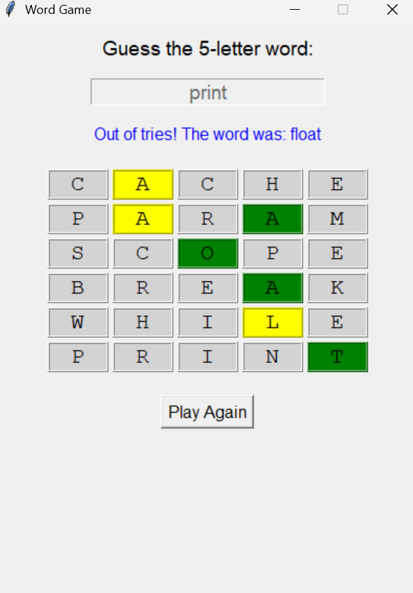

# Word-Guessing-Game
A Python based singleplayer Word Guessing game featuring limited attempts, real-time feedback, and input validation to enhance user experience. This project Implements core game logic using loops, conditionals, and string manipulation, reinforcing foundational programming concepts.

Here's what the game looks like:

